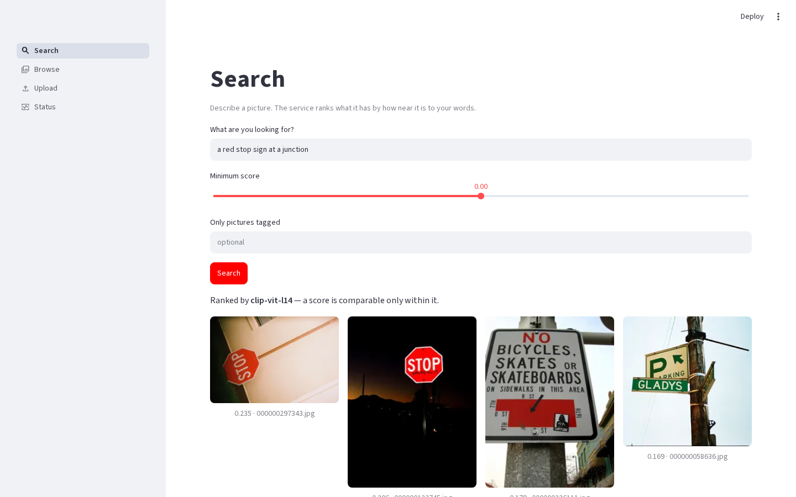
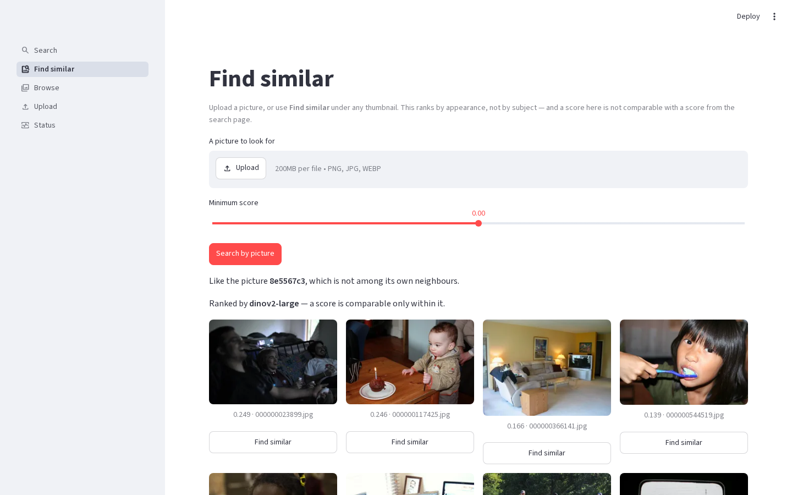
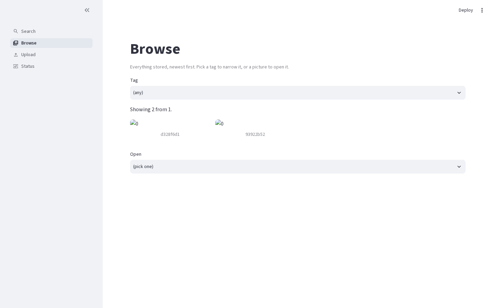
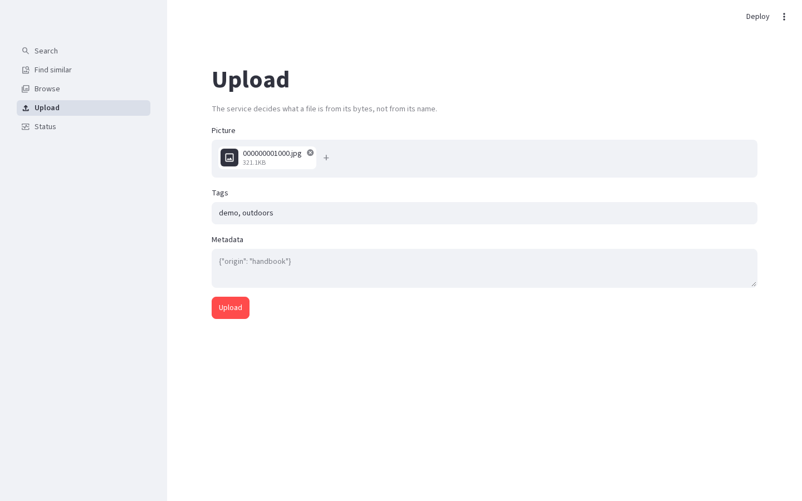
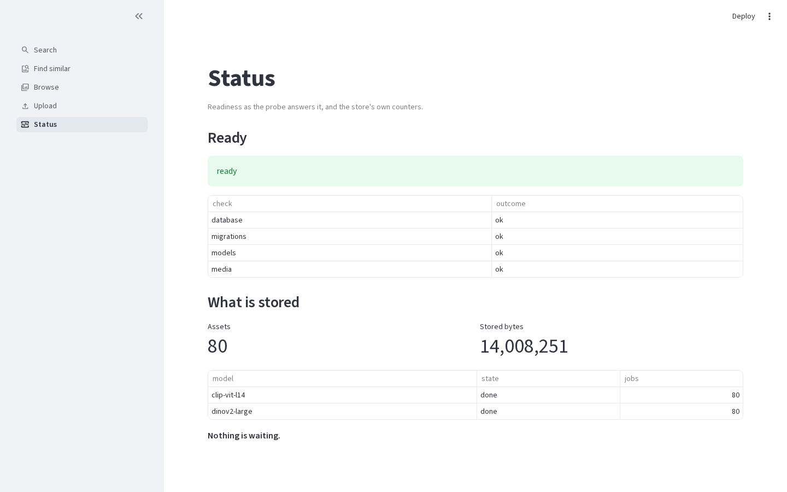
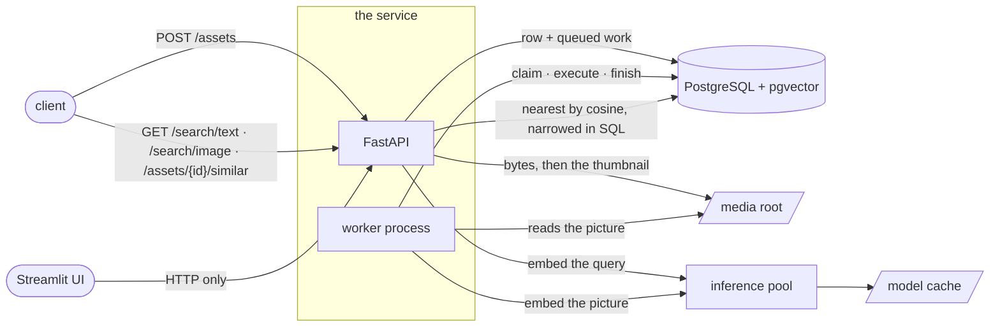

# SemanticShelf

Semantic search over images. Describe a picture in words and get the pictures
that match; or hand it a picture and get the ones that look like it. CLIP
(text→image) and DINOv2 (image→image) embeddings live in PostgreSQL with
pgvector, a FastAPI service answers, a worker does the model work, and a small
Streamlit interface shows it off.



<details>
<summary>The other four pages</summary>

**Find similar** — reached from any thumbnail; ranks by appearance, not by
subject, and says so.



**Browse** — the corpus with its tags, index status and metadata.



**Upload** — the service decides what a file is from its bytes, not its name.



**Status** — readiness, counts per model and what is queued.



</details>

## Run it

Containers, on a machine that has nothing but Docker:

```bash
make stack        # db, migrations, api, worker, ui — writes the local env file on first run
make demo         # a licence-filtered corpus from COCO val2017, indexed
```

The API is at <http://127.0.0.1:8000/api/docs>, the interface at
<http://127.0.0.1:8501>. Both ports are configurable and both bind to loopback.
Details, volumes and troubleshooting: [running the stack](docs/how-to/running-the-stack.md).

On the host, with [uv](https://docs.astral.sh/uv/) and Docker for the database:

```bash
sh scripts/stack-env.sh   # the local env file, with a generated database password
make init                 # sync, start pgvector, migrate
make run                  # http://127.0.0.1:8000/api/docs
make ui                   # http://127.0.0.1:8501
```

## What this shows

- **Two models behind one protocol** — CLIP for words→pictures, DINOv2 for
  pictures→pictures, loaded lazily, never on the event loop, replaced by a
  deterministic fake in every test that is not about the weights themselves
  ([models](docs/how-to/models.md)).
- **Vectors in PostgreSQL, not a second database** — one `embeddings` table,
  one partial HNSW index per model over a dimension cast, and the model key as
  part of an embedding's identity so two models are never compared
  ([ADR-001](docs/adr/ADR-001-per-model-vector-index-layout.md)).
- **An index that was measured rather than assumed** — recall@10 against an
  exact ranking, the `ef_search` curve, HNSW against IVFFlat, per model
  ([ADR-002](docs/adr/ADR-002-vector-index-family-and-parameters.md),
  [benchmarks](docs/how-to/benchmarks.md)).
- **Filters inside the vector query** — narrowing by tags and metadata is part
  of the ranking rather than a sieve over a page the database already chose, and
  an answer says when the scan stopped at its own bound
  ([searching](docs/how-to/searching.md)).
- **A queue that is a table** — `FOR UPDATE SKIP LOCKED`, leases, retries with
  backoff, at-least-once delivery with a fenced completion, and no broker
  ([ADR-003](docs/adr/ADR-003-queue-in-postgresql.md)).
- **A worker process** — `semanticshelf worker`, as many as you like on one
  queue; `INDEXING_RUNNER` decides whether the API does the work or leaves all
  of it to them ([indexing](docs/how-to/indexing.md)).
- **An upload path that trusts nothing** — the format is read from the bytes,
  the name a client sends never reaches a path, size and pixels are bounded
  before anything is decoded ([uploading](docs/how-to/uploading.md)).
- **The whole thing in containers** — two images from one Dockerfile, health
  deciding the startup order, state in volumes
  ([running the stack](docs/how-to/running-the-stack.md)).

## How it fits together



The request path never runs a model for an upload: it stores, queues and
answers. The job path is the worker's, and the only thing the two share is the
database and the media root.

## What it costs, and what it does not do

Measured, on a laptop CPU, with the numbers and the commands behind them in
[benchmarks](docs/how-to/benchmarks.md) and
[ADR-002](docs/adr/ADR-002-vector-index-family-and-parameters.md):

| | |
|---|---|
| Vector query, 10 000 vectors per model | p95 **1.6 ms** (CLIP) and **1.2 ms** (DINOv2) |
| recall@10 against an exact ranking | **1.000** at the effort the service ships with |
| Embedding a text query | ≤ 300 ms after warm-up |
| Embedding a query picture | ≤ 3 s (DINOv2-large at 224 px) |
| Images | service 1.79 GB, interface 762 MB |

Three boundaries, stated rather than discovered later:

- **No authentication.** It is a stated non-goal, not an oversight: the stack
  binds to loopback, and anything beyond a trusted network needs a reverse proxy
  that authenticates in front of it.
- **CPU only.** There is no device setting; a build that cannot be configured
  onto a GPU should not pretend to be. The latencies above are what that means.
- **English queries.** CLIP's text tower was trained on English captions; other
  languages degrade toward a random ranking. The service says so rather than
  translating, and a picture query has no language at all.

## Commands

`make help` lists them all. The ones worth knowing:

| | |
|---|---|
| `make stack` / `make stack-down` | the whole system in containers |
| `make init` / `make run` / `make ui` | the host workflow |
| `make demo` | fetch the demo corpus and index it |
| `make check` | lock + lint + format + types + unit and api tests |
| `make test-integration` | the suite that needs pgvector |
| `make audit` / `make sca-image` | known vulnerabilities in the lock, and in the image |
| `make screenshots` | the pictures above, from a real run |

## Reading further

| You want to… | Go to |
|---|---|
| Run it locally, or in containers | [how-to/local-development.md](docs/how-to/local-development.md) · [how-to/running-the-stack.md](docs/how-to/running-the-stack.md) |
| Understand how it is put together | [explanation/architecture.md](docs/explanation/architecture.md) |
| Read the specification it is built against | [explanation/requirements.md](docs/explanation/requirements.md) |
| See why a decision was made | [docs/adr/README.md](docs/adr/README.md) |
| Look up a setting or a command | [reference/settings.md](docs/reference/settings.md) · [reference/commands.md](docs/reference/commands.md) |
| See what is planned | [openspec/ROADMAP.md](openspec/ROADMAP.md) |
| See how this repository is worked on | [AGENTS.md](AGENTS.md) · [ADR-000](docs/adr/ADR-000-agent-workflow.md) |

Every feature here arrived through a reviewed OpenSpec change with an
independent review gate; the proposals, designs and review records are in
[`openspec/changes/archive/`](openspec/changes/archive/).

## Licence

MIT — see [LICENSE](LICENSE). The demo corpus is COCO val2017 under the licences
recorded in [reference/demo-dataset.md](docs/reference/demo-dataset.md); no
picture of it is committed to this repository.
